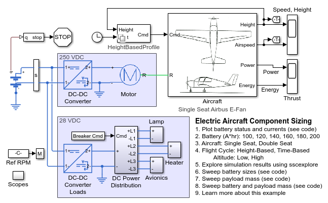
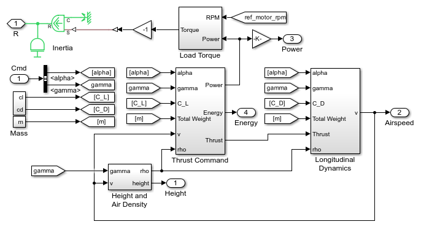

# **Electric Aircraft Model in Simscape&trade;**
Copyright 2023 The MathWorks, Inc.

These example models enable you to use simulation to evaluate electric 
and hybrid electric architectures against design criteria such as flight 
range and maximum flight time. The models are parameterized so that you 
can modify many aspects of the design, including automatic parameter sweeps 
of battery size and payload.

Open Airtaxi_Wing.prj to get started.

View on     
You can also open in MATLAB Online: 

## **Main Aircraft Model**

## **Chassis and Propeller**

## **Design Space: Battery Capacity and Payload**

To learn more about modeling and simulation with Simscape, please visit:
* [Simscape Getting Started Resources](https://www.mathworks.com/solutions/physical-modeling/resources.html)
* Product Capabilities:
   * [Simscape&trade;](https://www.mathworks.com/products/simscape.html)
   * [Simscape Battery&trade;](https://www.mathworks.com/products/simscape-battery.html)
   * [Simscape Driveline&trade;](https://www.mathworks.com/products/simscape-driveline.html)
   * [Simscape Electrical&trade;](https://www.mathworks.com/products/simscape-electrical.html)
   * [Simscape Fluids&trade;](https://www.mathworks.com/products/simscape-fluids.html)
   * [Simscape Multibody&trade;](https://www.mathworks.com/products/simscape-multibody.html)
